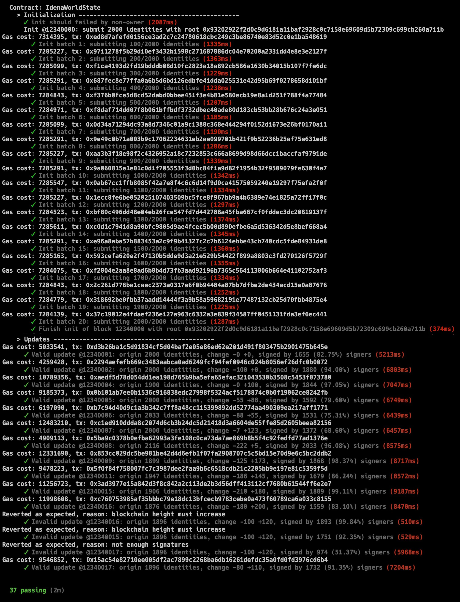

# Idena ETH Relay

Idena-ETH-Relay is used to make the validated cryptoidentities be relayed from the [Idena Blockchain](https://idena.io/) to [Ethereum Blockchain](https://ethereum.org/).

The idea of this project came from [Gitcoin Hackathon: GitxChange](https://gitcoin.co/issue/idena-network/idena-go/426/4357), and this solution was based on the "Possible Implementation" advice from idena official.

## Solution

This solution uses a relay smart contract to maintain validated cryptoidentities in ethereum blockchain from idena blockchain.

The inititial state of the smart contract need to be set after deploying by the owner (probably the idena official team), however, they can only do this once.
After the initialization, anyone who can provide the crypto-valid state transition can send an ethereum transactin to change the contract's state.

A crypto-valid state transition requires the previouse state, the new validated identities added, the old validated identities deleted, and the signatures of old validated participants confirming correctness of this transition.
These data of crypto-valid state transitions will be publicly available in the idena blockchain when the validated identity set changed (new epoch applied, kill identity, kill invitee).

This will make the relay contract maintain the up-to-date set of validated identities from idena blockchain without any trusted oracle(s) or organization(s).

We use the [BLS(Barreto Lynn Scott)](https://www.iacr.org/archive/asiacrypt2001/22480516.pdf) signature scheme instead of the ECDSA (secp256k1) used by both ETH1 and idena to have smaller inputs and consuming less gas.
Because quorum signatures are required for each contract state updating, and the BLS signature have suitable features like key aggregatation and multi-signature.
Due to the limitation of current evm, it is impractical to use the more secure BLS12-381 algorithm, we adopted the BLS-256 with alt-bn128 cureve for now.

The whole solution is mainly composed of two parts:
1. [The relay smart contract](https://github.com/idena-lab/eth-relay)
2. [The improved idena node](https://github.com/idena-lab/idena-go/tree/eth-relay)

### The Relay Smart Contract

Relay contract is responsible for maintaining addresses and BLS keys of all validated cryptoidentities from idena blockchain.

The address represents the validated identity in idena, its format is same as the ethereum address since both idena and ethereum use the same address rule.
The keys are [BLS(Barreto Lynn Scott)](https://www.iacr.org/archive/asiacrypt2001/22480516.pdf) public keys generated by [the improved idena node](https://github.com/idena-lab/idena-go/tree/eth-relay) with alt-bn128 curve. They are derived from the idena nodekey by default (see docs of node below).

Relay contract has three main interfaces for completing two main operations:
* `submitInitState()` is used to submit initial identities (addresses and BLS public keys) by owner. The initialization can only be performed once, while this function can be called multiple times before the end of initialization.
* `finishInit()` is used to end the initialization. This interface can only be successfully called by the owner too, and it can be called only once after deploying and for ever.
* `update()` is used to to update identities of the contract to keep pace with the idena blockchain. Anyone can call this interface, as long as he/she can provide the correct state change information and quorum signatures from validated identities. This infomation and signatures can be obtained from the improved idena node(please refer to the document of improved node below).

A sample relay contract has been deployed to the rinkeby testnet for testing, details can be found in [deploy-rinkeby.md](deploy-rinkeby.md).

Below is an example of test case output, which simulates a state initialization with 2000 identities and different update cases.
We can found gas costs of all the operations in the ouput as a reference.

More test outputs can be found in [test-results.md](./resources/test-results.md)

### The Improved Idena Node

You can find the improved node implementation [here](https://github.com/idena-lab/idena-go/tree/eth-relay).

Following are the design and implementation instructions for node modification:
* BLS keys used to generate multiple signatures will be derived from the idena nodekey(which is a secp256k1 ecc private key).
  The derivation algorithm can be found in [secstore](https://github.com/idena-lab/idena-go/blob/eth-relay/secstore/secure_store.go).
* To bind BLS keys to idena identities, nodes will publish the BLS public keys during the validation ceremony by sending
  a **BlsKeysTx** transaction to the blockchain.
  - In order to ensure that the published BLS keys are correct and valid, identities need to publish **both** the BLS public keys and a signature of their address by the BLS private key.
  - The published BLS public keys will be save to `stateIdentity` in `StateDB` first, and after the validation ceremony the keys of validated identities will be saved to `stateApprovedIdentity` in `IdentityStateDB` too.
  > Although it was said that BLS key is derived by the specific algorithm, it is only a default implementation of this improved node.
  > In fact, identities are not forced to use this method to generate a matching BLS key, they can publish any bls key generated by themselves as long as keeping the generated priavate key secret and safe.
* The `IdentityStateDB` will record the whole **relay state** matching the relay contract in ethereum, including all validated identities, their orders and BLS public keys. We will use order indexes to indicate the indentities to save gas.
  This **relay state** in `IdentityStateDB` will **change** when new identites are added or any old identity is deleted. Those will happen in the follow cases:
  - After the validation ceremony.
  - KillTx is found.
  - KillInviteeTx is found.
* When **relay state** is changed, node will need to do following works:
  1. Generated the difference info between current state and previous state. It will be sent to the relay contract in ethereum for state synchronization.
  2. Calculate a **state root** for the new **relay state** used for signature verification. **state root** is generated by height, previous state root, new identities, order indexes of deleted identities, the algorithm is exactly same as the relay contract.
     This implementation can be found in [relay.go](https://github.com/idena-lab/idena-go/blob/eth-relay/core/relay/relay.go).
  3. Collect enough signatures for this state change, and aggregate the signature into one for sending to the relay contract later.
* Idena node will collect signatures for each state change through gossip messages.
  The main collecting algorithm can be found in [relay's StateManager](https://github.com/idena-lab/idena-go/blob/eth-relay/core/relay/relay.go)
  > Other solutions have been considered, for example, collect signatures through onchain transactions, or modify block structure, or modify consensus voting, etc.
  > But it feels that these methods are too invasive to the idena blockchain, improper modification may cause serious problems, like reducing the performance of the blockchain, causing the consensus to lose liveness, etc.
  > So, the current implementation version adopts a loosely coupled and safer way, which has smaller impact on the idena blockchain and consensus.
  > In the future, it is necessary to consider these deeper implementation solutions.
* There will be a `RelayState` contains the state root and multisignature info of each block. `RelayState`s will be saved to database repo with `relayStatePrefix = []byte("relay")`, find it [here](https://github.com/idena-lab/idena-go/blob/eth-relay/database/schema.go).
* [Three new APIs](https://github.com/idena-lab/idena-go/blob/eth-relay/api/blockchain_api.go) are added to provide people or bots with the data needed to send transactions to relay contract.

## Improvements

* Make the relay contract to consume lower amount of gas.
* Split `update()` function to support multi-transactions calling.
  - Because an tranasaction may need more gas than block gas limit if there are to identities to add.
* The BLS signatures collection algorithm need to be improved.
* Adopt the BLS12-381 instead of bls with alt-bn128 after the hard-fork of ethereum blockchain with BLS12-381 support.
  - [EIP 2537: Precompile for BLS12-381 curve operations](https://eips.ethereum.org/EIPS/eip-2537)
  - [EIP 1962: EC arithmetic and pairings with runtime definitions](https://eips.ethereum.org/EIPS/eip-1962)

## Other Solutions

Idena ethereum relay is [a wonderful idea](https://gitcoin.co/issue/idena-network/idena-go/426/4357), and the solution adopted now is not perfect.

For example, the following directions are worthy of consideration and attention:
* Use [Zero-Knowledge Proofs](https://zkp.science) like zk-snarks or others to prove the correctness of transition.
* Adopt the BLS threshold signature (subgroup multisignature scheme, m-of-n multisig), which will make the verification more concise and efficient.

Any other solutions, ideas and suggestions are welcome.

## Tools and Apps

[bls-256-go](https://github.com/idena-lab/bls-256-go) implements the inial version of bls-256 signature used by the relay.

[relay-tools](https://github.com/idena-lab/relay-tools) implement some tools of idena ethereum relay. Currently it can be used to generate test data for relay contract.

More tools and apps are expected to be developed to make the relay work better and easier.
Such as the following tools (not limited to)
* A robot like program to monitor the idena blockchain and call relay contract to synchronous state.
* A frontend of the relay contract to show contract state more intuitively.
* DApps on the ethereum blockchain to integrated the validated cryptoidentities from idena.